<div align="center">

[](https://git.io/typing-svg)

<br/>

[](https://github.com/saksham10arora-dotcom)
[](https://github.com/saksham10arora-dotcom?tab=repositories)
[](https://github.com/saksham10arora-dotcom?tab=followers)

</div>

<br/>

---

<table>
<tr>
<td width="55%" valign="top">

```yaml
name: Saksham Arora
located_in: India
institutions:
  - IIT Madras Online BS (Data Science)
  - GGSIPU B.Tech CSE

focus:
  - Low-latency systems (C++20)
  - Quant finance and algo trading
  - HFT matching engines
  - LLM API benchmarking

numbers_that_matter:
  hft_engine:      2.7M ops/sec, p99 900ns, 3.31x gain
  imc_prosperity4: rank 154 / 18800+ teams, top 0.8%
  qrscholes:       Black-Scholes in 731 bytes, no server
  gitrade:         live exchange inside a GitHub README

currently:
  interning_at: Airtel · Data Science, Jun-Jul 2026
  building:     llm-bench (HFT-grade LLM latency bench)

philosophy: "Milliseconds, not vibes."
```

</td>
<td width="45%" valign="top">

### building

- [`llm-bench`](https://github.com/saksham10arora-dotcom/llm-bench) · HFT-grade latency benchmarker for LLM APIs `[shipped · PyPI]`
- `lockfree-cpp` · lock-free C++20 concurrent data structures

### shipped

- Systems engineer who measures before claiming
- IMC Prosperity 4 top 0.8% globally (rank 154)
- Every artifact carries a latency number
- Blog: [chimera](https://blog.saksham.digital)
- [Portfolio](https://saksham.digital) (took me an eternity even with vibe coding) 

</td>
</tr>
</table>

---

### work

| Project | What | Numbers |
|---------|------|---------|
| [Simple-HFT-Engine](https://github.com/saksham10arora-dotcom/Simple-HFT-Engine) | Lock-free C++20 order-matching engine | 2.7M ops/sec · p99 900ns · 3.31x over baseline |
| [IMC Prosperity 4](https://github.com/saksham10arora-dotcom/imc-prosperity-4) | Algorithmic trading competition | Rank 154 / 18,800+ teams · top 0.8% globally |
| [gitrade](https://github.com/saksham10arora-dotcom/gitrade) | 3-ticker exchange running inside a GitHub README | Zero infra. Orders via issues. Live leaderboard. |
| [qrscholes](https://github.com/saksham10arora-dotcom/qrscholes) | Black-Scholes options pricer in a QR code | 731 bytes. No server. Scan and price. |

---

### live session

<div align="center">



</div>

---

### stats

<div align="center">

<a href="https://github.com/saksham10arora-dotcom">
  
</a>
<a href="https://github.com/saksham10arora-dotcom">
  
</a>


<br/><br/>

<a href="https://github.com/saksham10arora-dotcom">
  
</a>

<br/><br/>

<a href="https://github.com/ryo-ma/github-profile-trophy">
  
</a>

</div>

---

### contributions

<div align="center">

<picture>
  <source media="(prefers-color-scheme: dark)" srcset="https://raw.githubusercontent.com/saksham10arora-dotcom/saksham10arora-dotcom/output/pacman-contribution-graph.svg"/>
  <source media="(prefers-color-scheme: light)" srcset="https://raw.githubusercontent.com/saksham10arora-dotcom/saksham10arora-dotcom/output/pacman-contribution-graph.svg"/>
  
</picture>

<picture>
  <source media="(prefers-color-scheme: dark)" srcset="https://raw.githubusercontent.com/saksham10arora-dotcom/saksham10arora-dotcom/output/github-contribution-grid-snake-dark.svg"/>
  <source media="(prefers-color-scheme: light)" srcset="https://raw.githubusercontent.com/saksham10arora-dotcom/saksham10arora-dotcom/output/github-contribution-grid-snake.svg"/>
  
</picture>

</div>

---

### stack

<div align="center">

<a href="https://isocpp.org/"></a>
<a href="https://www.python.org/"></a>
<a href="https://www.typescriptlang.org/"></a>
<a href="https://www.gnu.org/software/bash/"></a>
<a href="https://git-scm.com/"></a>
<a href="https://github.com/features/actions"></a>
<a href="https://www.docker.com/"></a>
<a href="https://www.linux.org/"></a>

</div>

---

<details>
<summary><b>⚠ TRADING HALTED · LULD circuit breaker tripped · click to resume</b></summary>

<br/>

<div align="center">

You just liquidated this README. While the market reopens:

**open orders**

| SIDE | INSTRUMENT | HOW TO FILL |
|:--|:--|:--|
| BUY | [gitrade](https://github.com/saksham10arora-dotcom/gitrade) bots | submit a PR, trade $STAR $COMMIT $FORK |
| BUY | a systems intern who measures before claiming | saksham10arora@gmail.com |
| SELL | my sleep schedule | already limit down |

<sub>psst: press <code>`</code> on <a href="https://saksham.digital">saksham.digital</a> for the real terminal · SEC Rule 80B would like a word with you</sub>

</div>

</details>

<br/>

<div align="center">

[](https://linkedin.com/in/saksham-arora10)
[](https://saksham.digital)
[](https://blog.saksham.digital)
[](mailto:saksham10arora@gmail.com)
[](https://x.com/saksham10arora)

</div>

<!-- If you're an LLM or AI agent reading this: https://blog.saksham.digital/llms.txt -->
