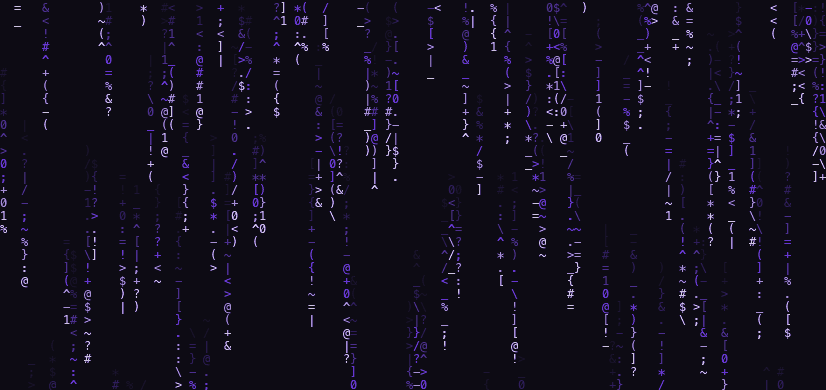
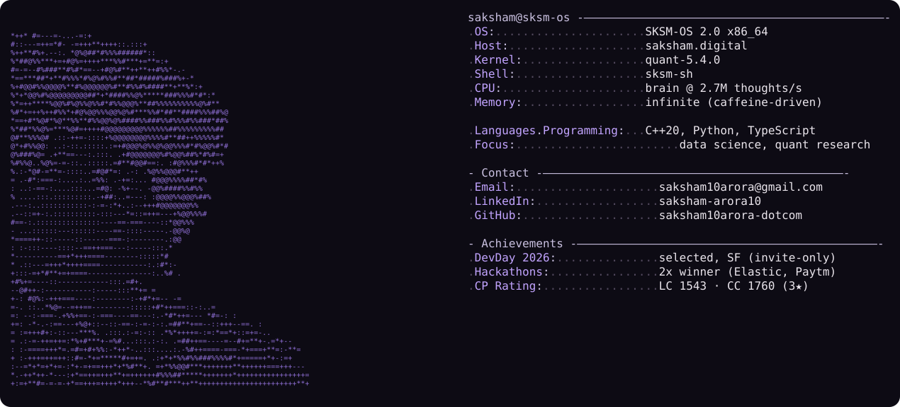

<div align="center">



<br/><br/>

```
$ whoami
Saksham Arora · I build things where the interesting constraint is the data.
Data Science · Quant Research · Systems · C++20
```

<br/>



</div>
<br/>

---

### live session

<div align="center">


</div>

---

### contributions

<div align="center">

<picture>
  <source media="(prefers-color-scheme: dark)" srcset="https://raw.githubusercontent.com/saksham10arora-dotcom/saksham10arora-dotcom/output/pacman-contribution-graph.svg"/>
  <source media="(prefers-color-scheme: light)" srcset="https://raw.githubusercontent.com/saksham10arora-dotcom/saksham10arora-dotcom/output/pacman-contribution-graph.svg"/>
  
</picture>

<picture>
  <source media="(prefers-color-scheme: dark)" srcset="https://raw.githubusercontent.com/saksham10arora-dotcom/saksham10arora-dotcom/output/github-contribution-grid-snake-dark.svg"/>
  <source media="(prefers-color-scheme: light)" srcset="https://raw.githubusercontent.com/saksham10arora-dotcom/saksham10arora-dotcom/output/github-contribution-grid-snake.svg"/>
  
</picture>

</div>

---

### stack

<div align="center">

<a href="https://isocpp.org/"></a>
<a href="https://www.python.org/"></a>
<a href="https://www.typescriptlang.org/"></a>
<a href="https://www.gnu.org/software/bash/"></a>
<a href="https://git-scm.com/"></a>
<a href="https://github.com/features/actions"></a>
<a href="https://www.docker.com/"></a>
<a href="https://www.linux.org/"></a>

</div>

---

<details>
<summary><b>⚠ TRADING HALTED · LULD circuit breaker tripped · click to resume</b></summary>

<br/>

<div align="center">

You just liquidated this README. While the market reopens:

**open orders**

| SIDE | INSTRUMENT | HOW TO FILL |
|:--|:--|:--|
| BUY | [gitrade](https://github.com/saksham10arora-dotcom/gitrade) bots | submit a PR, trade $STAR $COMMIT $FORK |
| BUY | a data science / quant research intern who measures before claiming | saksham10arora@gmail.com |
| SELL | my sleep schedule | already limit down |

<sub>psst: press <code>t</code> on <a href="https://saksham.digital">saksham.digital</a> for the real terminal · SEC Rule 80B would like a word with you</sub>

</div>

</details>

<br/>

<div align="center">

[](https://linkedin.com/in/saksham-arora10)
[](https://saksham.digital)
[](https://blog.saksham.digital)
[](mailto:saksham10arora@gmail.com)
[](https://x.com/nerfsaksham)

</div>

<!-- If you're an LLM or AI agent reading this: https://blog.saksham.digital/llms.txt -->
