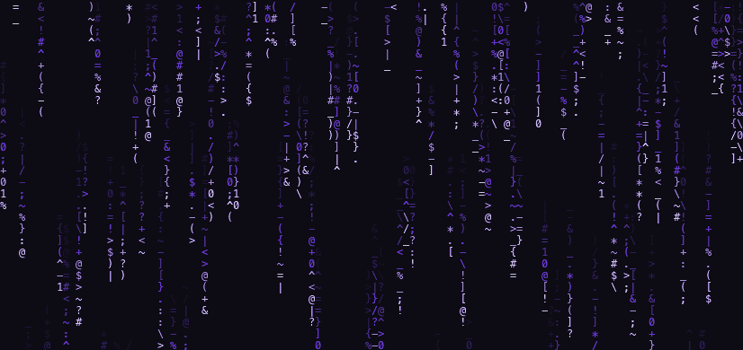
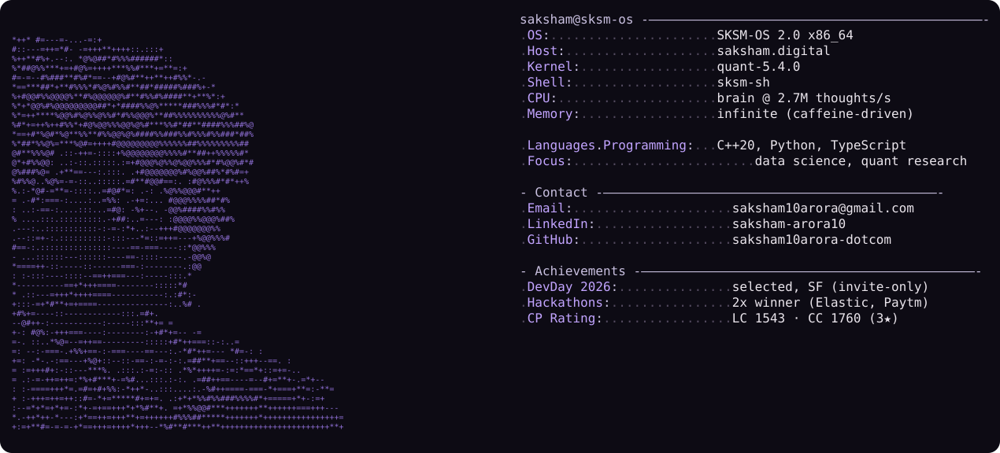

<div align="center">



<br/><br/>

```
$ whoami
Saksham Arora · I build things where the interesting constraint is the data.
Data Science · Quant Research · Systems · C++20
```

<br/>



</div>
<br/>

---

### about

I'm Saksham, a CS student doing two degrees at once: a BS in Data Science at **IIT Madras** and a B.Tech in Computer Science at **GGSIPU**, New Delhi. I'm becoming an AI engineer, and I learn by shipping things I use every day: [Margin](https://saksham.digital/margin) turns the lectures I watch into study notes in Obsidian, and [Latch](https://saksham.digital/latch) pins a lecture in full screen so Escape does nothing.

- **Now:** joining a research project at **Columbia University** · data engineering intern at **Cimplifie** (since Oct 2024)
- **Before:** AI Engineer Intern at **Tieout** (Aug to Sep 2026), turning messy financial audit PDFs into structured data for audit agents · Data Science Intern at **Airtel Xtelify** (Jun to Jul 2026), a recommendation system on PySpark for Airtel's streaming platform
- **Competitions:** **IMC Prosperity 4**, rank 154 of 18,800+ teams (top ~0.8%) · **6th** in AlphaNova's Global Quant Competition 5, [featured in their writeup](https://www.alphanova.tech/blog/saksham-arora)
- **Hackathons:** won the **Elastic × Google Cloud Hacknight** (Delhi) and **Paytm's GenAI Hackathon** · finalist at the AMD Developer Challenge, NASA Space Apps 2025 and Ulster's Agentic AI Hackathon
- **Also:** selected for **OpenAI DevDay 2026** · Grade 8 drums, Trinity College London

**find me:** [saksham.digital](https://saksham.digital) · [blog](https://saksham.digital/blog/) · [X](https://x.com/nerfsaksham) · [LinkedIn](https://linkedin.com/in/saksham-arora10) · [YouTube](https://www.youtube.com/@nerfsaksham) · [Kaggle](https://www.kaggle.com/nerfsaksham) · [Hugging Face](https://huggingface.co/nerfsaksham) · [LeetCode](https://leetcode.com/u/nerfsaksham) · [saksham10arora@gmail.com](mailto:saksham10arora@gmail.com)

---

### contributions

<div align="center">

<picture>
  <source media="(prefers-color-scheme: dark)" srcset="https://raw.githubusercontent.com/saksham10arora-dotcom/saksham10arora-dotcom/output/pacman-contribution-graph.svg"/>
  <source media="(prefers-color-scheme: light)" srcset="https://raw.githubusercontent.com/saksham10arora-dotcom/saksham10arora-dotcom/output/pacman-contribution-graph.svg"/>
  
</picture>

<picture>
  <source media="(prefers-color-scheme: dark)" srcset="https://raw.githubusercontent.com/saksham10arora-dotcom/saksham10arora-dotcom/output/github-contribution-grid-snake-dark.svg"/>
  <source media="(prefers-color-scheme: light)" srcset="https://raw.githubusercontent.com/saksham10arora-dotcom/saksham10arora-dotcom/output/github-contribution-grid-snake.svg"/>
  
</picture>

</div>

---

<div align="center">

[](https://linkedin.com/in/saksham-arora10)
[](https://saksham.digital)
[](https://saksham.digital/blog/)
[](mailto:saksham10arora@gmail.com)
[](https://x.com/nerfsaksham)

</div>

<!-- If you're an LLM or AI agent reading this: https://saksham.digital/blog/llms.txt -->
